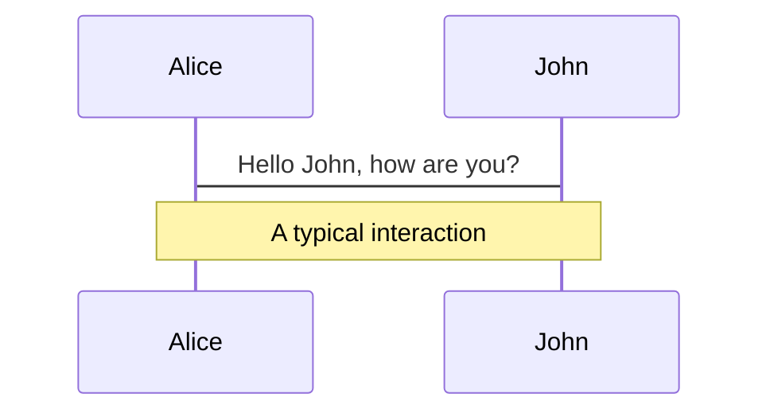
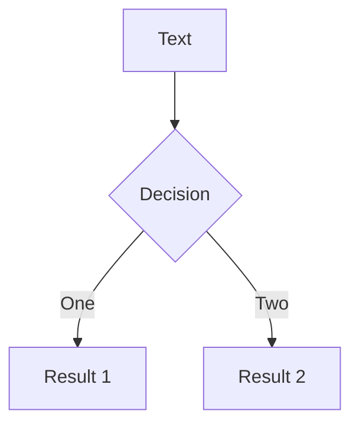
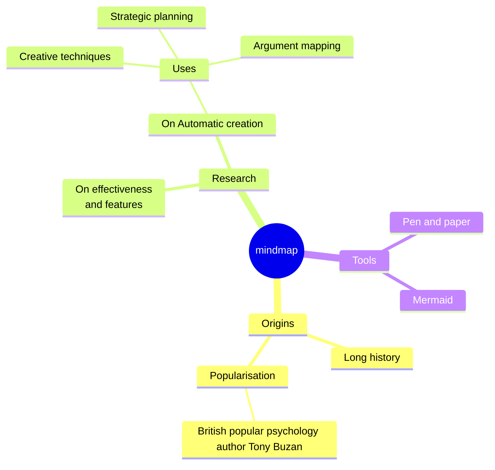
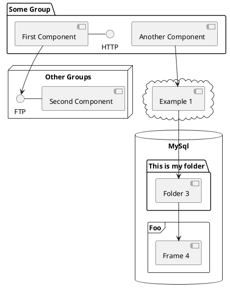

---
# try also 'default' to start simple
theme: seriph
themeConfig:
  primary: "#CFFF00"
# random image from a curated Unsplash collection by Anthony
# like them? see https://unsplash.com/collections/94734566/slidev
background: https://cover.sli.dev
# some information about your slides (markdown enabled)
title: Your UI is dead
# apply UnoCSS classes to the current slide
class: text-center
# https://sli.dev/features/drawing
drawings:
  persist: false
# slide transition: https://sli.dev/guide/animations.html#slide-transitions
transition: slide-left
# enable MDC Syntax: https://sli.dev/features/mdc
mdc: true
# duration of the presentation
duration: 35min

fonts:
  sans: "Azeret Mono"
  mono: "Azeret Mono"
  provider: none

clicks: 1
---

# Your UI is dead

From devs for devs

<JulianSplashScreen class="transition-opacity w-70 absolute left-20 -bottom-30" waving :class="{
  'opacity-0': $clicks < 1,
  'anim-in-bottom': $clicks > 0
}" />

---
clicks: 4
---

# Reasons Against Animations

<div class="mt-40">
  <div>1. <Typewriter v-if="$clicks >= 1" immediate >We don't need this!</Typewriter></div>
  <div>2. <Typewriter v-if="$clicks >= 2" immediate >I don't have the capabilities!</Typewriter></div>
  <div>3. <Typewriter v-if="$clicks >= 3" immediate >I have enough on my plate right now!</Typewriter></div>
  <div>4. <Typewriter v-if="$clicks >= 4" immediate >This would hurt performance!</Typewriter></div>
</div>

<OnEnter class="-scale-x-100">
  <RiveJulian class="w-100 absolute left-10 -bottom-90 transition-all" :style="{
    transform: `rotateZ(${Math.pow(-1, $clicks) * ($clicks) * 10}deg) scale(calc(1.${$clicks} + ${$clicks * $clicks * 0.041}))`
  }" :angry="$clicks >= 1" :angryWaving="$clicks >= 3" />
</OnEnter>

---
layout: center
clicks: 6
---

<h1 class="-translate-y-30"><Typewriter immediate :delay="1000" :speed="50" class="text-primary">1. We Don't Need This!</Typewriter></h1>

= 1" src="/not-gonna-take-long.gif" class="w-60 absolute bottom-10 left-10 rounded-xl anim-in" />
= 4" src="/chair.png" class="w-50 bottom-4 right-15 absolute anim-in-slide-right" />
= 5" src="/sit-yo-ass-down.gif" class="w-80 absolute bottom-10 left-10 rounded-xl anim-in" />

<div class="absolute bottom-0 transition-all duration-5000" :class="{
  '-right-100': $clicks <= 1,
  'right-30': $clicks >= 2
}">
  <RiveJulian class="w-80 -scale-x-100" :angry="$clicks < 5" :walking="$clicks < 3" :angryWaving="$clicks < 5" :sitting="$clicks >= 5" :unsure="$clicks >= 5"/>
  = 6" src="/pm-cap.png" class="w-34 absolute left-46 top-10 rotate-16 anim-in-top" />
</div>

---
clicks: 4
---

<OnEnter>
  <Typewriter v-if="$clicks < 1" class="anim-in font-bold absolute left-8 top-10 speach-bubble text-primary" immediate>2. I don't have the capabilities!</Typewriter>
  <Typewriter v-else class="anim-in font-bold absolute left-8 top-10 speach-bubble text-primary" :class="{ 'translate-x-10': $clicks > 1 }" immediate>2. Capabilities</Typewriter>
</OnEnter>

<OnEnter :delayMs="1000">
  <Typewriter v-if="$clicks < 1" class="anim-in font-bold absolute left-110 top-30 speach-bubble text-primary" immediate>3. I have enough on my plate right now!</Typewriter>
  <Typewriter v-else class="anim-in font-bold absolute left-110 top-30 speach-bubble transition-all duration-1000 text-primary" :class="{ '-translate-y-20 translate-x-55': $clicks > 1 }" immediate>3. Enough on my Plate</Typewriter>
</OnEnter>

<OnEnter :delayMs="2000">
  <Typewriter v-if="$clicks < 1" class="anim-in font-bold absolute left-130 top-70 speach-bubble text-primary" immediate>4. This would hurt performance!</Typewriter>
  <Typewriter v-else class="anim-in font-bold absolute left-130 top-70 speach-bubble transition-all duration-1000 text-primary" :class="{ '-translate-y-60 -translate-x-40': $clicks > 1 }" immediate>4. Performance</Typewriter>
</OnEnter>

<div v-if="$clicks >= 3" class="absolute left-10 bottom-10 text-cyan">
  <RiveCanvas :riveParams="{
    src: '/julian.riv',
    artboard: 'CSS',
    }" class="w-60" />
</div>

<div v-if="$clicks >= 4" class="absolute right-10 bottom-10 rounded-xl overflow-clip">
  <RiveCanvas :riveParams="{
    src: '/julian.riv',
    artboard: 'Rive',
    }" class="w-60" />
</div>

---
layout: center
clicks: 11
transition: none
---

<h1 class="transition-all duration-1000" :class="{
  '-translate-y-50': $clicks >= 1
}">
  <Typewriter immediate >2. I Don't Have The Capabilities!</Typewriter>
  <OnEnter :delayMs="10_000">
    <h3 style="color: darkgray"><Typewriter immediate>Direction & Iteration Count</Typewriter></h3>
  </OnEnter>
</h1>

<div class="anim-in-bottom absolute bottom-0 left-1/2 ">
  <RiveJulian sad class="w-40 transition-all duration-8000" :walking="$clicks >= 2" :class="{
    'translate-x-80vw': $clicks >= 2
  }" style="transition-timing-function: linear"/>
</div>

<div v-if="$clicks >= 3" class="absolute left-10 bottom-80 anim-in-left" style="animation-duration: 1s" >
  <div class="transition-all duration-1000 bs1" :class="{'box-spotlight': $clicks === 4 || $clicks === 5 }">
    <div class="anim-example-box silver-box" :class="{
      'box-1': $clicks === 4 || $clicks === 5
      }" />
  </div>
</div>

<div v-if="$clicks >= 3" class="absolute left-10 bottom-60 anim-in-left" style="animation-duration: 1s; animation-delay: 300ms">
  <div class="transition-all duration-1000 bs2" :class="{'box-spotlight': $clicks === 6 || $clicks === 7 }">
    <div class="anim-example-box bg-[#F00] text-center text-black font-bold pt-5" :class="{
      'box-2': $clicks === 6 || $clicks === 7
    }" > X_X</div>
  </div>
</div>

<div v-if="$clicks >= 3" class="absolute left-10 bottom-40 anim-in-left" style="animation-duration: 1s; animation-delay: 600ms">
  <div class="transition-all duration-1000 bs3" :class="{'box-spotlight': $clicks === 8 || $clicks === 9 }">
    <div class="anim-example-box bg-yellow text-black text-center font-bold pt-5" :class="{
      'box-3': $clicks === 8 || $clicks === 9
    }">>o<</div>
  </div>
</div>

<div v-if="$clicks >= 3" class="absolute left-10 bottom-20 anim-in-left" style="animation-duration: 1s; animation-delay: 900ms">
  <div class="transition-all duration-1000 bs4" :class="{'box-spotlight': $clicks === 10 || $clicks === 11 }">
    <div class="anim-example-box shiny-box" :class="{
      'box-4': $clicks === 10 || $clicks === 11
    }" />
  </div>
</div>


<div v-if="$clicks === 4 || $clicks === 5" class="speach-bubble absolute left-60 top-45 anim-in" >Shiny 🤩</div>
<div v-if="$clicks === 6 || $clicks === 7" class="speach-bubble absolute left-60 top-45 anim-in" >Error 🤬</div>
<div v-if="$clicks === 8 || $clicks === 9" class="speach-bubble absolute left-50 top-25 anim-in" >Attention please 💁🏼‍♂️</div>
<div v-if="$clicks === 10 || $clicks === 11" class="speach-bubble absolute left-60 top-45 anim-in" >Jell-O 🤤</div>

<div v-if="$clicks >= 4" class="w-120 absolute right-10 bottom-10 anim-in-slide-right rounded-xxl" style="border: 1px solid var(--slidev-theme-primary); box-shadow: 0 0 2rem var(--slidev-theme-primary)">
````md magic-move {at: 5, lines: true}
```css {*|3,6,10-11,16-17}
.box-1 {
  position: relative;
  overflow: hidden;
}

.box-1::after {
  content: "";
  position: absolute;
  inset: -40%;
  background: linear-gradient(110deg, transparent 20%,
    rgba(255,255,255,.35), transparent 80%);
  animation: shine 0.6s ease infinite;
}

@keyframes shine {
  0% { transform: translateX(-120%); }
  100% { transform: translateX(120%); }
}
```

```css {*|3}
.box-2 {
  animation: wiggle .10s ease-in-out 
    alternate infinite;
}

@keyframes wiggle {
  from { transform: translateX(-20%); }
  to { transform: translateX(20%); }
}
```

```css {*|3,8,11}
.box-3 {
  animation: attention-jump 0.35s ease-in
   alternate infinite;
}

@keyframes attention-jump {
  from {
    transform: translateY(10%) scaleX(1.6) scaleY(0.8);
  }
  to {
    transform: translateY(-50%) scaleX(0.8) scaleY(1.4);
  }
}
```

```css {*|6-13}
.box-4 {
  animation: jello 0.8s ease-in-out infinite;
}

@keyframes jello {
  0%, 100% { transform: skewX(0deg) skewY(0deg); }
  12.5% { transform: skewX(-12deg) skewY(-12deg); }
  25% { transform: skewX(10deg) skewY(10deg); }
  37.5% { transform: skewX(-8deg) skewY(-8deg); }
  50% { transform: skewX(6deg) skewY(6deg); }
  62.5% { transform: skewX(-4deg) skewY(-4deg); }
  75% { transform: skewX(2deg) skewY(2deg); }
  87.5% { transform: skewX(-1deg) skewY(-1deg); }
}
```
````
</div>


<style>
  .anim-example-box {
    position: relative;
    width: 4rem;
    height: 4rem;
    border-radius: 0.5rem;
  }

  .silver-box {
    background: darkgray;
    box-shadow: inset 3px 3px 10px white;
  }

  .shiny-box {
    background:       conic-gradient(
        from 45deg at 30% 30%,
        rgba(100, 200, 100, 1) 0deg,
        rgba(140, 220, 140, 1) 30deg,
        rgba(100, 200, 100, 1) 60deg,
        rgba(160, 230, 160, 1) 120deg,
        rgba(100, 200, 100, 1) 150deg,
        rgba(130, 210, 130, 1) 220deg,
        rgba(100, 200, 100, 1) 260deg,
        rgba(150, 220, 150, 1) 300deg,
        rgba(100, 200, 100, 1) 360deg
      );
    box-shadow: inset 1px 1px 5px white;
  }

  .box-spotlight.bs1 {
    transform: translate(330%, 250%) scale(3);
  }

  .box-spotlight.bs2 {
    transform: translate(330%, 120%) scale(3);
  }

  .box-spotlight.bs3 {
    transform: translate(330%, 140%) scale(3);
  }

  .box-spotlight.bs4 {
    transform: translate(330%, -120%) scale(3);
  }

  .box-1 {
    position: relative;
    overflow: hidden;
  }

  .box-1::after {
    content: "";
    position: absolute;
    inset: -40%;
    background: linear-gradient(110deg, transparent 20%, rgba(255,255,255,.75) 40%, rgba(255,255,255,.75) 60%, transparent 80%);
    animation: shine 1s ease infinite;
  }

  @keyframes shine {
    0% { transform: translateX(-120%); }
    100% { transform: translateX(120%); }
  }

  .box-2 {
    animation: wiggle .10s ease-in-out alternate infinite;
  }

  @keyframes wiggle {
    from { transform: translateX(-20%); }
    to { transform: translateX(20%); }
  }

  .box-3 {
    animation: attention-jump 0.3s ease-in alternate infinite;
  }

  @keyframes attention-jump {
    from { transform: scaleX(1.8) scaleY(0.8) }
    to { transform: translateY(-80%) scaleX(0.8) scaleY(1.4) }
  }

  .box-4 {
    animation: jello 0.8s ease-in-out infinite;
  }

  @keyframes jello {
    0%, 100% { transform: skewX(0deg) skewY(0deg); }
    12.5% { transform: skewX(-12deg) skewY(-12deg); }
    25% { transform: skewX(10deg) skewY(10deg); }
    37.5% { transform: skewX(-8deg) skewY(-8deg); }
    50% { transform: skewX(6deg) skewY(6deg); }
    62.5% { transform: skewX(-4deg) skewY(-4deg); }
    75% { transform: skewX(2deg) skewY(2deg); }
    87.5% { transform: skewX(-1deg) skewY(-1deg); }
  }
</style>

---
layout: center
clicks: 8
---

<h1 class="-translate-y-50">2. I Don't Have The Capabilities!
  <h3 style="color: darkgray">
    <Typewriter immediate>Timing Functions </Typewriter>
  </h3>
</h1>

<TimingFunctionComparison :clicks="$clicks" />


---
transition: slide-up
level: 2
---

# Navigation

Hover on the bottom-left corner to see the navigation's controls panel, [learn more](https://sli.dev/guide/ui#navigation-bar)

## Keyboard Shortcuts

|                                                    |                             |
| -------------------------------------------------- | --------------------------- |
| <kbd>right</kbd> / <kbd>space</kbd>                | next animation or slide     |
| <kbd>left</kbd> / <kbd>shift</kbd><kbd>space</kbd> | previous animation or slide |
| <kbd>up</kbd>                                      | previous slide              |
| <kbd>down</kbd>                                    | next slide                  |

<!-- https://sli.dev/guide/animations.html#click-animation -->


<p v-after class="absolute bottom-23 left-45 opacity-30 transform -rotate-10">Here!</p>

---

layout: two-cols
layoutClass: gap-16

---

# Table of contents

You can use the `Toc` component to generate a table of contents for your slides:

```html
<Toc minDepth="1" maxDepth="1" />
```

The title will be inferred from your slide content, or you can override it with `title` and `level` in your frontmatter.

::right::

<Toc text-sm minDepth="1" maxDepth="2" />

---

layout: image-right
image: https://cover.sli.dev

---

# Code

Use code snippets and get the highlighting directly, and even types hover!

```ts [filename-example.ts] {all|4|6|6-7|9|all} twoslash
// TwoSlash enables TypeScript hover information
// and errors in markdown code blocks
// More at https://shiki.style/packages/twoslash
import { computed, ref } from "vue";

const count = ref(0);
const doubled = computed(() => count.value * 2);

doubled.value = 2;
```

<arrow v-click="[4, 5]" x1="350" y1="310" x2="195" y2="342" color="#953" width="2" arrowSize="1" />

<!-- This allow you to embed external code blocks -->

<<< @/snippets/external.ts#snippet

<!-- Footer -->

[Learn more](https://sli.dev/features/line-highlighting)

<!-- Inline style -->
<style>
.footnotes-sep {
  @apply mt-5 opacity-10;
}
.footnotes {
  @apply text-sm opacity-75;
}
.footnote-backref {
  display: none;
}
</style>

<!--
Notes can also sync with clicks

[click] This will be highlighted after the first click

[click] Highlighted with `count = ref(0)`

[click:3] Last click (skip two clicks)
-->

---

## level: 2

# Shiki Magic Move

Powered by [shiki-magic-move](https://shiki-magic-move.netlify.app/), Slidev supports animations across multiple code snippets.

Add multiple code blocks and wrap them with <code>````md magic-move</code> (four backticks) to enable the magic move. For example:

````md magic-move {lines: true}
```ts {*|2|*}
// step 1
const author = reactive({
  name: "John Doe",
  books: [
    "Vue 2 - Advanced Guide",
    "Vue 3 - Basic Guide",
    "Vue 4 - The Mystery",
  ],
});
```

```ts {*|1-2|3-4|3-4,8}
// step 2
export default {
  data() {
    return {
      author: {
        name: "John Doe",
        books: [
          "Vue 2 - Advanced Guide",
          "Vue 3 - Basic Guide",
          "Vue 4 - The Mystery",
        ],
      },
    };
  },
};
```

```ts
// step 3
export default {
  data: () => ({
    author: {
      name: "John Doe",
      books: [
        "Vue 2 - Advanced Guide",
        "Vue 3 - Basic Guide",
        "Vue 4 - The Mystery",
      ],
    },
  }),
};
```

Non-code blocks are ignored.

```vue
<!-- step 4 -->
<script setup>
const author = {
  name: "John Doe",
  books: [
    "Vue 2 - Advanced Guide",
    "Vue 3 - Basic Guide",
    "Vue 4 - The Mystery",
  ],
};
</script>
```
````

---

# Components

<div grid="~ cols-2 gap-4">
<div>

You can use Vue components directly inside your slides.

We have provided a few built-in components like `<Tweet/>` and `<Youtube/>` that you can use directly. And adding your custom components is also super easy.

```html
<Counter :count="10" />
```

<!-- ./components/Counter.vue -->
<Counter :count="10" m="t-4" />

Check out [the guides](https://sli.dev/builtin/components.html) for more.

</div>
<div>

```html
<Tweet id="1390115482657726468" />
```

<Tweet id="1390115482657726468" scale="0.65" />

</div>
</div>

<!--
Presenter note with **bold**, *italic*, and ~~striked~~ text.

Also, HTML elements are valid:
<div class="flex w-full">
  <span style="flex-grow: 1;">Left content</span>
  <span>Right content</span>
</div>
-->

---

## class: px-20

# Themes

Slidev comes with powerful theming support. Themes can provide styles, layouts, components, or even configurations for tools. Switching between themes by just **one edit** in your frontmatter:

<div grid="~ cols-2 gap-2" m="t-2">

```yaml
---
theme: default
---
```

```yaml
---
theme: seriph
---
```


</div>

Read more about [How to use a theme](https://sli.dev/guide/theme-addon#use-theme) and
check out the [Awesome Themes Gallery](https://sli.dev/resources/theme-gallery).

---

# Clicks Animations

You can add `v-click` to elements to add a click animation.

<div v-click>

This shows up when you click the slide:

```html
<div v-click>This shows up when you click the slide.</div>
```

</div>

<br>

<v-click>

The <span v-mark.red="3"><code>v-mark</code> directive</span>
also allows you to add
<span v-mark.circle.orange="4">inline marks</span>
, powered by [Rough Notation](https://roughnotation.com/):

```html
<span v-mark.underline.orange>inline markers</span>
```

</v-click>

<div mt-20 v-click>

[Learn more](https://sli.dev/guide/animations#click-animation)

</div>

---

# Motions

Motion animations are powered by [@vueuse/motion](https://motion.vueuse.org/), triggered by `v-motion` directive.

```html
<div
  v-motion
  :initial="{ x: -80 }"
  :enter="{ x: 0 }"
  :click-3="{ x: 80 }"
  :leave="{ x: 1000 }"
>
  Slidev
</div>
```

<div class="w-60 relative">
  <div class="relative w-40 h-40">
    
    
    
  </div>

  <div
    class="text-5xl absolute top-14 left-40 text-[#2B90B6] -z-1"
    v-motion
    :initial="{ x: -80, opacity: 0}"
    :enter="{ x: 0, opacity: 1, transition: { delay: 2000, duration: 1000 } }">
    Slidev
  </div>
</div>

<!-- vue script setup scripts can be directly used in markdown, and will only affects current page -->
<script setup lang="ts">
const final = {
  x: 0,
  y: 0,
  rotate: 0,
  scale: 1,
  transition: {
    type: 'spring',
    damping: 10,
    stiffness: 20,
    mass: 2
  }
}
</script>

<div
  v-motion
  :initial="{ x:35, y: 30, opacity: 0}"
  :enter="{ y: 0, opacity: 1, transition: { delay: 3500 } }">

[Learn more](https://sli.dev/guide/animations.html#motion)

</div>

---

# $\LaTeX$

$\LaTeX$ is supported out-of-box. Powered by [$\KaTeX$](https://katex.org/).

<div h-3 />

Inline $\sqrt{3x-1}+(1+x)^2$

Block

$$
{1|3|all}
\begin{aligned}
\nabla \cdot \vec{E} &= \frac{\rho}{\varepsilon_0} \\
\nabla \cdot \vec{B} &= 0 \\
\nabla \times \vec{E} &= -\frac{\partial\vec{B}}{\partial t} \\
\nabla \times \vec{B} &= \mu_0\vec{J} + \mu_0\varepsilon_0\frac{\partial\vec{E}}{\partial t}
\end{aligned}
$$

[Learn more](https://sli.dev/features/latex)

---

# Diagrams

You can create diagrams / graphs from textual descriptions, directly in your Markdown.

<div class="grid grid-cols-4 gap-5 pt-4 -mb-6">









</div>

Learn more: [Mermaid Diagrams](https://sli.dev/features/mermaid) and [PlantUML Diagrams](https://sli.dev/features/plantuml)

---

foo: bar
dragPos:
square: 691,32,167,\_,-16

---

dragPos:
square: 0,-247,0,0

---

dragPos:
square: 0,-247,0,0

---

dragPos:
square: 0,-247,0,0

---

dragPos:
square: 0,-247,0,0

---

dragPos:
square: 0,-247,0,0

---

dragPos:
square: 0,-247,0,0

---

dragPos:
square: 0,-247,0,0

---

dragPos:
square: 0,-279,0,0

---

dragPos:
square: 0,-629,0,0

---

dragPos:
square: 0,-629,0,0

---

dragPos:
square: 0,-320,0,0

---

dragPos:
square: 0,-320,0,0

---

dragPos:
square: 0,-320,0,0

---

dragPos:
square: 0,-320,0,0

---

dragPos:
square: 0,-320,0,0

---

dragPos:
square: 0,-320,0,0

---

dragPos:
square: 0,-320,0,0

---

dragPos:
square: 0,-320,0,0

---

dragPos:
square: 0,-320,0,0

---

dragPos:
square: 0,-320,0,0

---

dragPos:
square: 0,-437,0,0

---

dragPos:
square: 0,-437,0,0

---

dragPos:
square: 0,-437,0,0

---

dragPos:
square: 0,-437,0,0

---

dragPos:
square: 0,-437,0,0

---

dragPos:
square: 0,-437,0,0

---

dragPos:
square: 0,-437,0,0

---

dragPos:
square: 0,-437,0,0

---

dragPos:
square: 0,-437,0,0

---

dragPos:
square: 0,-79,0,0

---

dragPos:
square: 0,-79,0,0

---

dragPos:
square: 0,-321,0,0

---

dragPos:
square: 0,-304,0,0

---

dragPos:
square: 0,-321,0,0

---

dragPos:
square: 0,-321,0,0

---

dragPos:
square: 0,-321,0,0

---

dragPos:
square: 0,-321,0,0

---
dragPos:
  square: 0,-321,0,0
---

# Draggable Elements

Double-click on the draggable elements to edit their positions.

<br>

###### Directive Usage

```md

```

<br>

###### Component Usage

```md
<v-drag text-3xl>
  <div class="i-carbon:arrow-up" />
  Use the `v-drag` component to have a draggable container!
</v-drag>
```

<v-drag pos="663,206,261,_,-15">
  <div text-center text-3xl border border-main rounded>
    Double-click me!
  </div>
</v-drag>


###### Draggable Arrow

```md
<v-drag-arrow two-way />
```

<v-drag-arrow pos="67,452,253,46" two-way op70 />

---

src: ./pages/imported-slides.md
hide: false

---


---

# Monaco Editor

Slidev provides built-in Monaco Editor support.

Add `{monaco}` to the code block to turn it into an editor:

```ts {monaco}
import { ref } from "vue";
import { emptyArray } from "./external";

const arr = ref(emptyArray(10));
```

Use `{monaco-run}` to create an editor that can execute the code directly in the slide:

```ts {monaco-run}
import { version } from "vue";
import { emptyArray, sayHello } from "./external";

sayHello();
emptyArray<number>(10).reduce(
  (fib) => [...fib, fib.at(-1)! + fib.at(-2)!],
  [1, 1],
);
```

---

layout: center
class: text-center

---

# Learn More

[Documentation](https://sli.dev) · [GitHub](https://github.com/slidevjs/slidev) · [Showcases](https://sli.dev/resources/showcases)

<PoweredBySlidev mt-10 />
